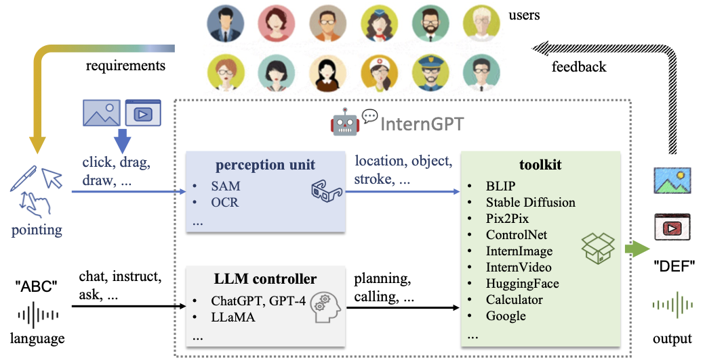
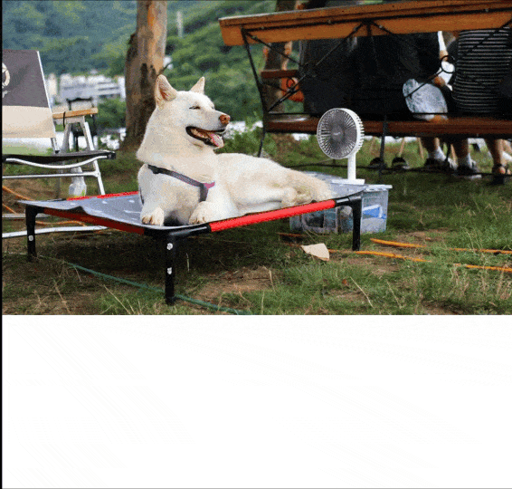
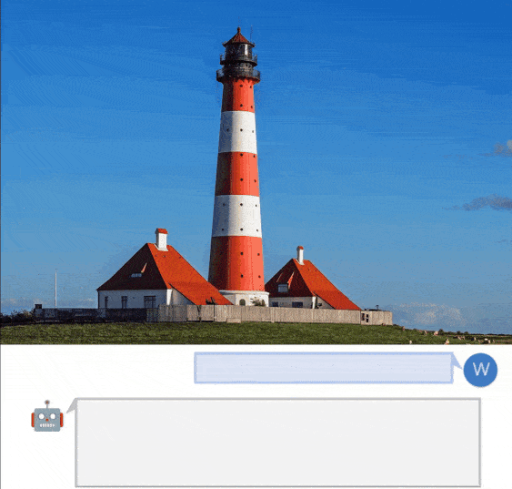
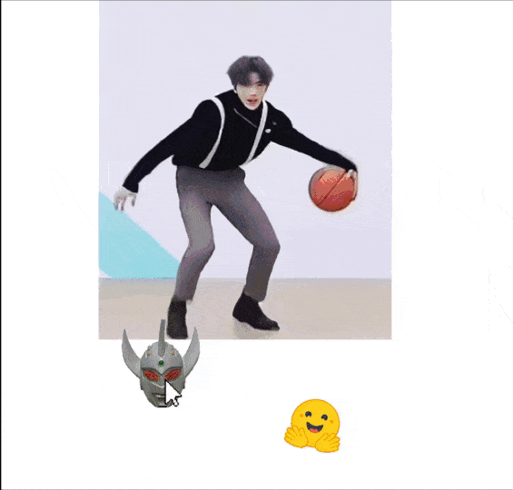
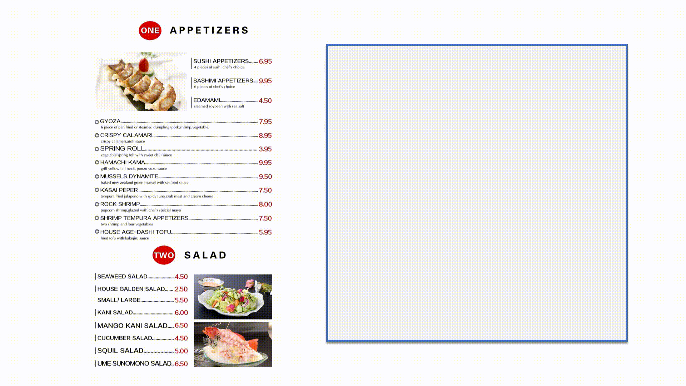
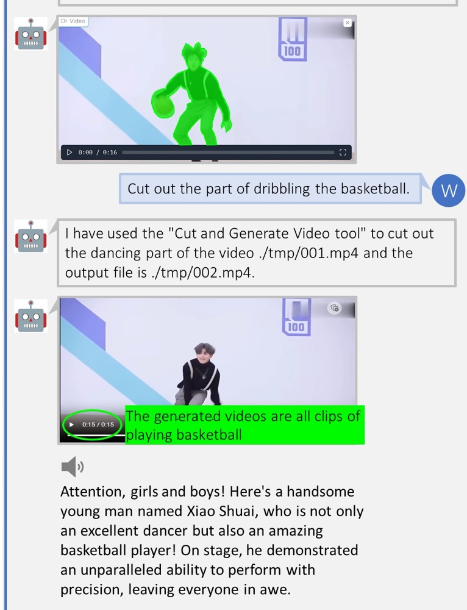

[[中文文档]](README_CN.md)

**The project is still under construction, we will continue to update it and welcome contributions/pull requests from the community.**

<p align="center"></p>

<a src="https://img.shields.io/discord/1099920215724277770?label=Discord&logo=discord" href="https://discord.gg/khWBFnCgAN">
     </a> | <a src="https://img.shields.io/badge/GPU%20Demo-Open-green?logo=alibabacloud" href="https://ichat.opengvlab.com">
     </a> | <a src="https://img.shields.io/twitter/follow/opengvlab?style=social" href="https://twitter.com/opengvlab">
      </a> 
    


# 🤖💬 InternGPT [[Paper](https://arxiv.org/pdf/2305.05662.pdf)] 


<!-- ## Description -->
**InternGPT**(short for **iGPT**) / **InternChat**(short for **iChat**) is pointing-language-driven visual interactive system, allowing you to interact with ChatGPT by clicking, dragging and drawing using a pointing device. The name InternGPT stands for **inter**action, **n**onverbal, and Chat**GPT**. Different from existing interactive systems that rely on pure language, by incorporating pointing instructions, iGPT significantly improves the efficiency of communication between users and chatbots, as well as the accuracy of chatbots in vision-centric tasks, especially in complicated visual scenarios. Additionally, in iGPT, an auxiliary control mechanism is used to improve the control capability of LLM, and a large vision-language model termed **Husky** is fine-tuned for high-quality multi-modal dialogue (impressing ChatGPT-3.5-turbo with **93.89% GPT-4 Quality**).

## 🥳 🚀 What's New 
- (2023.05.18) We have supported [ImageBind](https://github.com/facebookresearch/ImageBind) 🎉🎉🎉. Please see the [video demo](https://github.com/OpenGVLab/InternGPT/assets/13723743/bacf3e58-6c24-4c0f-8cf7-e0c4b8b3d2af) for the usage. Let's try this awesome feauture: [Demo](https://igpt.opengvlab.com/).

- (2023.05.15) The [model_zoo](https://huggingface.co/spaces/OpenGVLab/InternGPT/tree/main/model_zoo) including HuskyVQA has been released! Try it on your local machine!

- (2023.05.15) Our code is also publicly available on [Hugging Face](https://huggingface.co/spaces/OpenGVLab/InternGPT)! You can duplicate the repository and run it on your own GPUs.

## 🤖💬 Online Demo
**InternGPT** is online (see [https://igpt.opengvlab.com](https://igpt.opengvlab.com/)). Let's try it!

[**NOTE**] It is possible that you are waiting in a lengthy queue. You can clone our repo and run it with your private GPU.

### 🧭 User Manual

After uploading the image, you can have a **multi-modal dialogue** by sending messages like: `"what is it in the image?"` or `"what is the background color of image?"`.     
You also can interactively operate, edit or generate the image as follows:
- You can click the image and press the button **`Pick`** to **visualize the segmented region** or press the button **`OCR`** to **recognize the words** at chosen position;
- To **remove the masked reigon** in the image, you can send the message like: `"remove the masked region"`;
- To **replace the masked reigon** in the image, you can send the message like: `"replace the masked region with {your prompt}"`;
- To **generate a new image**, you can send the message like: `"generate a new image based on its segmentation describing {your prompt}"`
- To **create a new image by your scribble**, you should press button **`Whiteboard`** and draw in the board. After drawing, you need to press the button **`Save`** and send the message like: `"generate a new image based on this scribble describing {your prompt}"`.

**Update**:
       
We now support [ImageBind](https://github.com/facebookresearch/ImageBind). If you want to generate a new image conditioned on audio, you can upload an audio file in advance:
- To **generate a new image from a single audio file**, you can send the message like: `"generate a real image from this audio"`;
- To **generate a new image from audio and text**, you can send the message like: `"generate a real image from this audio and {your prompt}"`;
- To **generate a new image from audio and image**, you need to upload an image and then send the message like: `"generate a new image from above image and audio"`;


<p align="center"></p>

https://github.com/OpenGVLab/InternGPT/assets/13723743/8fd9112f-57d9-4871-a369-4e1929aa2593

Video Demo with ImageBind:

https://github.com/OpenGVLab/InternGPT/assets/13723743/bacf3e58-6c24-4c0f-8cf7-e0c4b8b3d2af


## 🗓️ Schedule
- [ ] Support [VisionLLM](https://github.com/OpenGVLab/VisionLLM)
- [ ] Support Chinese
- [ ] Support MOSS
- [ ] More powerful foundation models based on [InternImage](https://github.com/OpenGVLab/InternImage) and [InternVideo](https://github.com/OpenGVLab/InternVideo)
- [ ] More accurate interactive experience
- [ ] OpenMMLab toolkit
- [ ] Web page & code generation 
- [ ] Support search engine 
- [ ] Low cost deployment
- [x] Support [ImageBind](https://github.com/facebookresearch/ImageBind)
- [x] Response verification for agent
- [x] Prompt optimization
- [x] User manual and video demo
- [x] Support voice assistant
- [x] Support click interaction
- [x] Interactive image editing
- [x] Interactive image generation
- [x] Interactive visual question answering
- [x] Segment anything
- [x] Image inpainting
- [x] Image caption
- [x] Image matting
- [x] Optical character recognition
- [x] Action recognition
- [x] Video caption
- [x] Video dense caption
- [x] Video highlight interpretation


## 🏠 System Overview
<p align="center"></p>

## 🎁 Major Features 
<details>
<summary>Remove the masked object</summary>
<p align="center"></p>
</details>

<details>
<summary>Interactive image editing</summary>
<p align="center"></p>
</details>

<details>
<summary>Image generation</summary>
<p align="center"></p>
</details>

<details>
<summary>Interactive visual question answer</summary>
<p align="center"></p>
</details>

<details>
<summary>Interactive image generation</summary>
<p align="center"></p>
</details>

<details>
<summary>Video highlight interpretation</summary>
<p align="center"></p>
</details>


## 🛠️ Installation

### Basic requirements

- Linux 
- Python 3.8+ 
- PyTorch 1.12+
- CUDA 11.6+ 
- GCC & G++ 5.4+
- GPU Memory >= 17G for loading basic tools (HuskyVQA, SegmentAnything, ImageOCRRecognition)
</details>

### Install Python dependencies

```shell
conda create -n ichat python=3.8
conda activate ichat
pip install -r requirements.txt
```


### 🗃 Model zoo
our `model_zoo` has been released in [huggingface](https://huggingface.co/spaces/OpenGVLab/InternGPT/tree/main/model_zoo)! 
You can download it and directly place it into the root directory of this repo before running the app.

HuskyVQA, a strong VQA model, is also available in `model_zoo`. More details can refer to our [report](https://arxiv.org/pdf/2305.05662.pdf).

## 👨‍🏫 Get Started 
Running the following shell can start a gradio service:
```shell
python -u app.py --load "HuskyVQA_cuda:0,SegmentAnything_cuda:0,ImageOCRRecognition_cuda:0" --port 3456
```

if you want to enable the voice assistant, please use `openssl` to generate the certificate:
```shell
mkdir certificate
openssl req -x509 -newkey rsa:4096 -keyout certificate/key.pem -out certificate/cert.pem -sha256 -days 365 -nodes
```

and then run:
```shell
python -u app.py --load "HuskyVQA_cuda:0,SegmentAnything_cuda:0,ImageOCRRecognition_cuda:0" --port 3456 --https
```


## 🎫 License

This project is released under the [Apache 2.0 license](LICENSE). 

## 🖊️ Citation

If you find this project useful in your research, please consider cite:

```BibTeX
@misc{2023interngpt,
    title={InternGPT: Solving Vision-Centric Tasks by Interacting with ChatGPT Beyond Language},
    author={Zhaoyang Liu and Yinan He and Wenhai Wang and Weiyun Wang and Yi Wang and Shoufa Chen and Qinglong Zhang and Yang Yang and Qingyun Li and Jiashuo Yu and Kunchang Li and Zhe Chen and Xue Yang and Xizhou Zhu and Yali Wang and Limin Wang and Ping Luo and Jifeng Dai and Yu Qiao},
    howpublished = {\url{https://arxiv.org/abs/2305.05662}},
    year={2023}
}
```

## 🤝 Acknowledgement
Thanks to the open source of the following projects:

[Hugging Face](https://github.com/huggingface) &#8194;
[LangChain](https://github.com/hwchase17/langchain) &#8194;
[TaskMatrix](https://github.com/microsoft/TaskMatrix) &#8194;
[SAM](https://github.com/facebookresearch/segment-anything) &#8194;
[Stable Diffusion](https://github.com/CompVis/stable-diffusion) &#8194; 
[ControlNet](https://github.com/lllyasviel/ControlNet) &#8194; 
[InstructPix2Pix](https://github.com/timothybrooks/instruct-pix2pix) &#8194; 
[BLIP](https://github.com/salesforce/BLIP) &#8194;
[Latent Diffusion Models](https://github.com/CompVis/latent-diffusion) &#8194;
[EasyOCR](https://github.com/JaidedAI/EasyOCR) &#8194;
[ImageBind](https://github.com/facebookresearch/ImageBind) &#8194;


Welcome to discuss with us and continuously improve the user experience of InternGPT.

WeChat QR Code

<p align="center"></p> 

