# 🛠️Installation：
## Basic requirements
* Linux
* Python 3.8+
* PyTorch 1.12+
* CUDA 11.6+
* GCC & G++ 5.4+
* GPU Memory >= 17G for loading basic tools(HuskyVQA, SegmentAnything, ImageOCRRecognition)
  
## Install anaconda
Reference Installation Tutorial : [English Tutorial](https://linuxize.com/post/how-to-install-anaconda-on-ubuntu-20-04/) or [Chinese Tutorial](https://zhuanlan.zhihu.com/p/440548295)

## Clone project
Execute the following command in the root directory:
```
git clone https://github.com/OpenGVLab/InternGPT.git
```
Common errors and their resolutions : 
1. git installation status: done
   Execute the following command in the terminal
     `git --version`
   If it is not installed, execute the following command.
   `sudo apt install git`
2. If the download speed is too slow:
   modify the preceding command as follows:
   `git clone git://github.com/OpenGVLab/InternGPT.git` 

## 🗃Model zoo
our `model_zoo` has been released in [huggingface](https://huggingface.co/spaces/OpenGVLab/InternGPT/tree/main/model_zoo)! 
You can download it and directly place it into the root directory of this repo before running the app.

HuskyVQA, a strong VQA model, is also available in `model_zoo`. More details can refer to our [report](https://arxiv.org/pdf/2305.05662.pdf).

**Note for husky checkpoint**

Due to the license issuse, we could directly provide the checkpoint of Husky. The `model_zoo` contains the delta checkpoint between Husky and [LLAMA](https://github.com/facebookresearch/llama). 

To build the actual checkpoint of Husky, you need the original checkpoint of LLAMA, which should be put in `model_zoo/llama/7B`. We support automatically download the llama checkpoint, but you need to request a form for the download url from Meta (see [here]((https://github.com/facebookresearch/llama))). Once you have the download url, paste it into `PRESIGNED_URL=""` at [third-party/llama_download.sh](third-party/llama_download.sh).

Then, rerun the app would automatically download the original checkpoint, convert it to huggingface format, and build the Husky checkpoint. 

Please make sure these folder `model_zoo/llama`, and  `model_zoo/llama_7B_hf` contain the correct checkpoint, otherwise you should delete the folder and let the app download it again.
Otherwise, you might encounter issuses similar as [issue #5](https://github.com/OpenGVLab/InternGPT/issues/5)
> model_zoo\llama_7B_hf does not appear to have a file named config.json. 

> FileNotFoundError: [Errno 2] No such file or directory: 'model_zoo/llama/7B/params.json'
> 
**Current project directory structure**

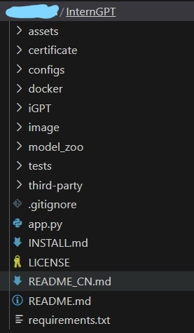

## :tent:Install dependencies
* **Create a virtual environment**
  `conda activate -n igpt python=3.8`
  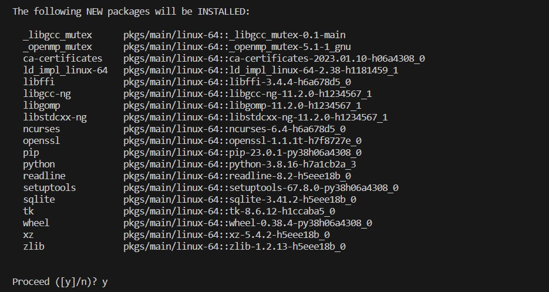
  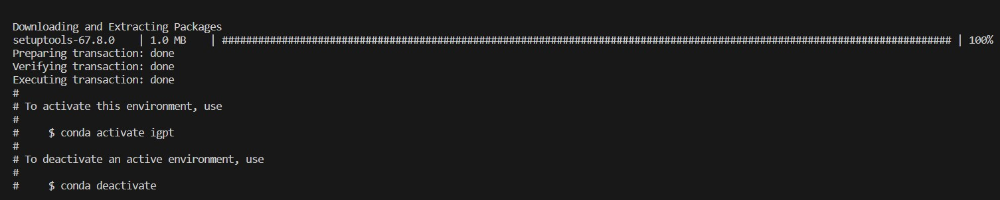
* **Activate the virtual environment**
  `conda activate igpt`
  *Verify if you have successfully entered the virtual environment*
  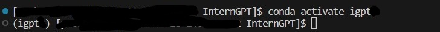

* **Install essential  dependencies**
  `conda install pytorch==1.13.0 torchvision==0.14.0 torchaudio==0.13.0 pytorch-cuda=11.6 -c pytorch -c nvidia`
  **notices**:Download all dependencies simultaneously and ensure to include "-c pytorch -c nvidia" to avoid version conflicts.
  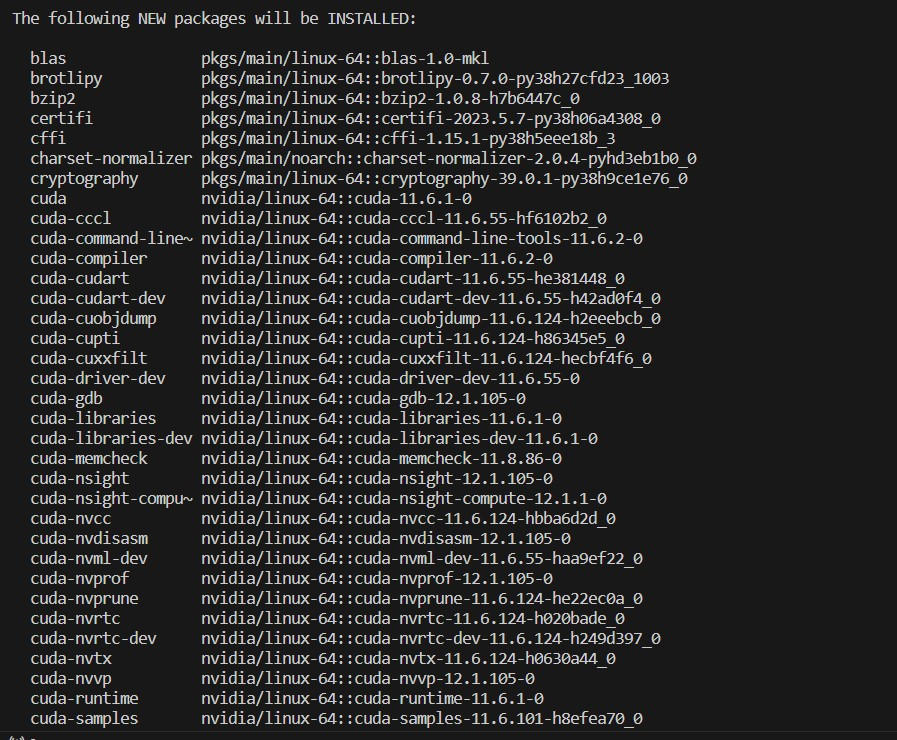
  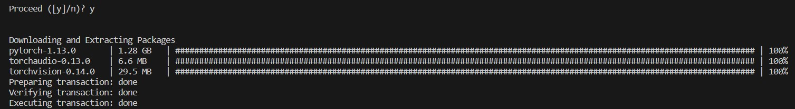

* **Install additional dependencies**
  `pip install -r requirements.txt`
  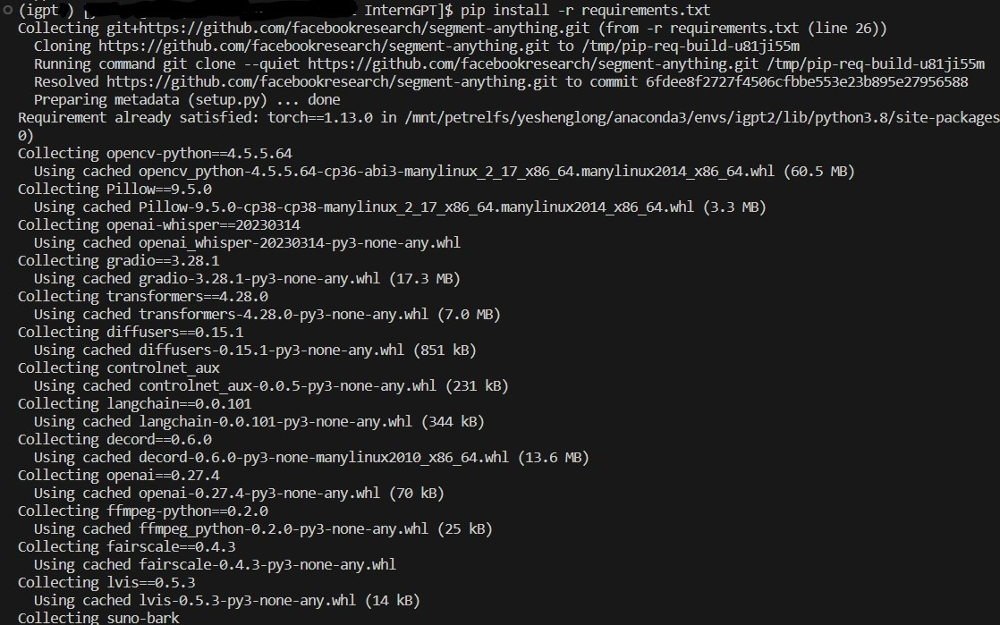
  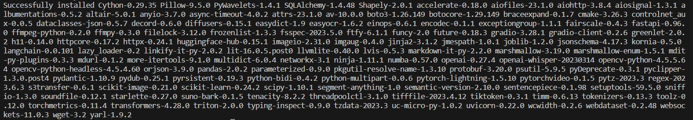

* **Install detectron2**
  * Install gcc & g++
    `apt-get install gcc`
    `apt-get install g++`
    `apt-get install make`
    **notices**:For most systems, the latest version of GCC and G++ will be downloaded automatically. To check the version of GCC, execute the command `gcc --version`. If the version is lower than 5.4, please refer to the following instructions to download the specific version: [down gcc](https://blog.csdn.net/liboyang71/article/details/77152577)
   * Install detectron2
     `git clone https://github.com/facebookresearch/detectron2.git`
     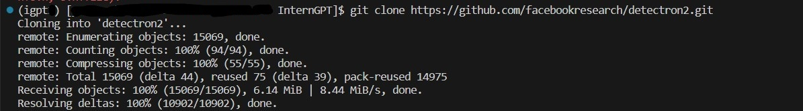
     `python -m pip install -e detectron2`
     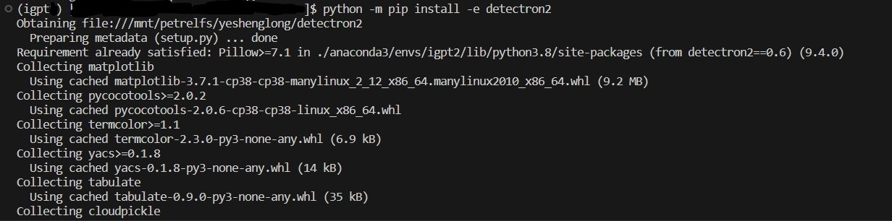
     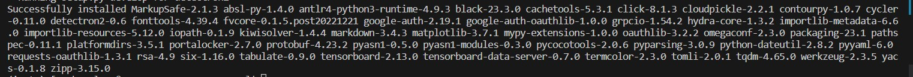
   * notices
     When encountering the messages "Compile without GPU support" or "Detectron2 CUDA compiler: Not available," please consider the following:
     ``` 
     python -c "import torch
     from torch.utils.cpp_extension import CUDA_HOME
     print(torch.cuda.is_available(), CUDA_HOME)"
     ```


## Start the service
`python -u app.py \
--load "ImageOCRRecognition_cuda:0,Text2Image_cuda:0,SegmentAnything_cuda:0,ActionRecognition_cuda:0,VideoCaption_cuda:0,DenseCaption_cuda:0,ReplaceMaskedAnything_cuda:0,LDMInpainting_cuda:0,SegText2Image_cuda:0,ScribbleText2Image_cuda:0,Image2Scribble_cuda:0,Image2Canny_cuda:0,CannyText2Image_cuda:0,StyleGAN_cuda:0,Anything2Image_cuda:0,HuskyVQA_cuda:0" -e -p 3456 --https
`

Now, you can access iGPT demo by visiting `https://{ip}:3456` through your browser:
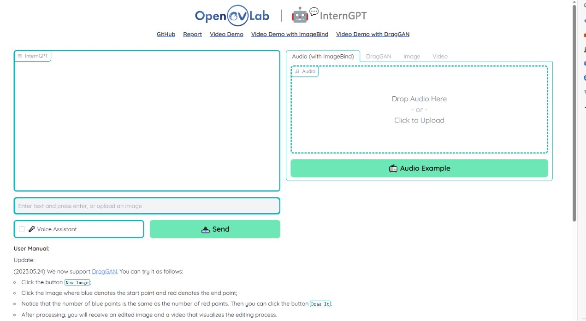

# Deploying with docker

* **Installation**
Please refer to the official documentation to install: [Docker](https://docs.docker.com/engine/install/), [Docker compose](https://docs.docker.com/compose/install/) , and [ NVIDIA Container Toolkit](https://docs.nvidia.com/datacenter/cloud-native/container-toolkit/install-guide.html#install-guide).

* **Build and run an image**
  Please add model_zoo and certificate folders to the root directory of this repo, and change `/path/to/model_zoo` and `/path/to/certificate` in `docker/docker-compose.yml` to model_zoo and certificate directories on your machine respectively.

  For more features of our iGPT, You can modify the `load` variable in the `command` section in the docker compose file.

  ```shell
  cd docker
  # Build and run an image (require GPUs):
  docker compose up 

  ```
